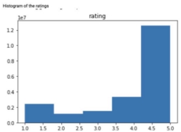
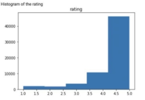

# Amazon-Recommendation-Engine

**ISyE 6740 – Spring 2022 Project Report** 

**Team Members** 

Chia Jung Tsou (903455971), Minghui Lu (903555739), Jonhua Qin(903551009) 

**Project Title** 

Build a Recommendation Engine with Amazon Product Review Dataset 

**Problem Statement** 

Understanding what customers potentially want is always an interesting problem to solve. What makes this challenging is that everyone has their own preference, which could change over time. Now, the needs vary depending on the shoppers. Some shoppers focus on reviews, some focus on rating, or price, or a combination of the above variables. Therefore, it is an important task for retailers to be able to predict what the customers like or need, and make recommendations accordingly. 

For this project, we are going to analyze an Amazon dataset. The dataset contains ratings of Amazon users to various electronic products, revealing their preference to particular categories of items. We will apply two collaborative filtering techniques to find out the most relevant items of a targeted user and evaluate which is more effective. 

**Data Source** 

`            `We decided to use a subset of Amazon Product Review Data that was released in 2018[4]. There are a total of 233.1 million data points ranging from May 1996 to October 2018. Given the amount of the data, we decided to use the Electronics sector for the recommendation. Since this is one of the most profitable categories, there is more business value in making a prediction there. With that, we have 20,994,353 data points ranging from December 1997 to October 2018. The data is presented in csv with the following fields:  

- Item: bigint 
- User: random string 
- Rating: float 
- Timestamp: unix time 

The data will be downloaded as csv file and imported into the Python environment. This dataset will be used to train the algorithm and will remain unchanged throughout the project, given that the newly addition of users and reviews are not considered in scope. 

**Literature Review** 

The inspiration of this project comes from an online article [1] that illustrates the underlying concept of building a recommendation engine called Collaborative Filtering. In the article, the author used the MovieLens dataset and the Surprise Python library to predict the rating score a user would give to a movie that is never watched. Then the system would recommend top movies with the highest predicted rating.  

In other articles [2][3], the authors demonstrated an alternative recommendation engine building technique called Content Based Filtering. This algorithm recommends products that have similar features to the ones that a user has liked in the past. Given we do not have data on product features, this algorithm will not be implemented for this project. 

One common challenge in building the recommendation engine is called Cold Start. This describes the scenario when a new user or product is added to the list, and there is no sufficient data to make recommendations for them. While Content-Based Filtering can be used to address the product cold-start issue, a popularity model could be built to recommend the most popular products to a new user. Given our dataset does not contain a cold-start scenario, the popularity model will not be implemented in our project. 

**Methodology** 

We will focus on the implementation of Collaborative Filtering (CF) algorithm. There are two approaches to this problem - user-based vs. item-based. For the user-based approach, users with similar interest and preference would likely give out similar reviews to the same products. For item-based CF, we say the items are similar when they received similar ratings from the same user. Then, we will make predictions for a target user on an item by calculating the weighted average rating on the most similar items from this user. One key advantage of item-based CF is the stability, such that the ratings on a given item will not change significantly over time, unlike the tastes of human beings. 

In terms of user preference, it is usually expressed by two categories. Explicit Rating is a review given by a user to an item on a sliding scale (e.g., 5 stars for the movie Titanic). This is the most direct feedback from users to show how much they like an item. Implicit Rating suggests user preference indirectly, such as page views, clicks, purchase records, whether or not to listen to a music track, and so on. In this project, we will focus on Explicit Rating. 

For the first approach, we could implement a clustering algorithm **(K-nearest Neighbors)** to find users that are similar to the target customers. The similarity will be evaluated using Cosine Similarity metric, where we take the weighted average of ratings from users. 

*Equation 1: Predict rating using weighted average* 

` `Different people may have different baselines when giving ratings. While some people tend to give generous scores in general, and some tend to give out lower rating even though they are satisfied with items. To account for this behavioral bias, we can calculate the weighted bias of ratings based on similarity and add to the average rating to get the final prediction. 

*Equation 2: Compute predicted rating using the weighted average* 

In addition, we used the cosine distance to calculate similarity: 

*Equation 3: Cosine Similarity formula* 

For Item-based CF, we treat two products as similar when they received similar ratings from the same user. Then, we will make predictions on an item given by a user by calculating weighted average rating for similar items from this user. One key advantage of Item-based CF is the stability, such that the ratings on a given item would not change significantly over time. 

Alternatively, given that user-item affinity matrix will be sparse (each user will only rate a small subset of products), we could implement **Singular Value Decomposition (SVD)** to reduce the number of features in the model, such that only the most important features (latent features) will be used in calculating similarity. We will apply **Gradient Descent (GD)** to find the optimal singular vectors that minimize the error of prediction.  

Both algorithms will return a score for each user-pair, revealing the similarity between users. These scores will be used to compute the weighted average ratings of the product that the target user has not purchased. The predicted rating will be sorted in descending order to indicate the preference of the user.  

**Data Exploration** 

The dataset contains 756,489 unique items and 9,838,676 unique users. The dataset does not contain detail description of the items, but a unique identifier is provided instead (we have reached out to the data source but received no response).  

 

*Diagram 1: Rating Distribution of the original dataset* 

**Data Preparation** 

Since the given dataset is large, we decided to trim it down by performing data slicing. First, we tried to filter for the top 1,000 items that were given the most ratings. Then, we removed the record of any user that has provided less than ten ratings. Doing this would retain the most data for training while effectively reducing the dimension of the user-item matrix. The below histogram shows the distribution of the trimmed dataset is heavily skewed to the right, which exhibits similarity to the data distribution before trimming. 

 

*Diagram 2: Rating Dsitribution of the trimmed dataset* 

For evaluation purposes, we split the trimmed dataset by a 80-20 ratio, such that 20% of the data will be reserved for testing. After the split, the training dataset consisted of 4,963 users and 1000 items, while the test dataset contained the same number of users and 975 items. 

**Implementation Details** 

The first step of the implementation involves building a user-item matrix. This is a matrix with n\*m in size, in which n denotes the number of users and m denotes the number of items. Each row in the matrix contains the activity history about a user. The arrays are filled with ratings for any user u given to item i. As for the user-item pair that has not been provided a rating, the value of x is prefilled by 0. Separate user-item matrices were created for training 

ui

and testing datasets on the same dimension and size. 

Next, we will proceed to build a recommendation engine using the method of Collaborative Filtering. This method allows us to “filter” for similar users or items and then use their rating information to predict the missing score. But unlike the conventional clustering algorithms, in which the similarity is computed using their native features, we used behavioral data to find users that are similar in nature. In this case, the data are the product rating reviews provided by users in the past. We used the pairwise\_distance function in the sklearn package to compute the cosine distances between the users. The distances reveal the “user neighbors”, then we take a weighted sum of them to predict the rating the target user would give to any item. In addition, if the input matrix contains more items than users, we could apply a similar method using the weighted sum of ratings on neighboring items. 

In addition to the Nearest Neighbors method, we also applied the concepts of Singular Value Decomposition and Gradient Descent to derive a prediction matrix. We would like to approximate the rating matrix using the dot product of matrix P (with size M\*K) and Q (with size N\*K), which K represents the number of latent features and K < N. The latent features helps to remove unnecessary noise in the feature set. The matrix P and Q can be derived using matrix factorization, and given our goal is to minimize MSE, we could set an objective function as the squared error to solve for P and Q. 

*Equation 4: Squared Error* 

In this objective function, rui stands for the actual rating, and r-hat stands for the rating prediction for the user u to item i, which is approximated by the dot product of matrix P, beta (the regularization parameter for bias), and Q. Then, we could take derivatives against puk and q to find the gradients. So, we have:  

ki

*Equation 5: Gradients for p and q* 

Next, by implementing the Gradient Descent method, we use iterations to update the values of p and q . We could define a learning rate, alpha, to decide the size of each update. 

uk ki

The updates will be repeated until we reach the maximum number of iterations or a minimum MSE. The algorithm would capture the learning process to show the MSE change for each iteration, and the results will be demonstrated in the next section. After the optimal P and Q matrices are derived, we could multiply them together to obtain the prediction matrix. 

*Equation 6: Update p and q values using gradient descent* 

**Model Comparison and Results** 

For the Nearest Neighbors approach, we built a function using the above methodology and compared predictions against the test dataset. The results indicated that the prediction using neighboring users has a Mean Squared Error (MSE) score of 511, and the MSE for neighboring item prediction is 517. 

As for the SVD and Gradient Descent approach, we trained five models using different combinations of the parameters, alpha, beta, and K. The below table shows details of the model and the training and testing results: 

|**Model #** |**Alpha** |**Beta** |**K** |**MSE @ i=20** |**MSE @ i=40** |**MSE @ i=80** |**MSE @ i=80** |**MSE @ i=100** |**MSE - test data** |
| :- | - | - | - | :- | :- | :- | :- | :- | :- |
|1 |0\.001 |0\.01 |20 |199\.19 |192\.03 |187\.34 |183\.90 |181\.07 |104\.22 |
|2 |0\.001 |0\.01 |50 |199\.43 |199\.52 |188\.15 |185\.14 |182\.90 |104\.32 |
|3 |0\.01 |0\.01 |20 |162\.64 |98\.49 |57\.34 |38\.27 |**28.56** |112\.85 |
|4 |0\.001 |0\.1 |20 |199\.45 |192\.60 |188\.32 |185\.42 |183\.36 |104\.22 |
|5 |0\.005 |0\.01 |20 |181\.12 |163\.25 |131\.89 |100\.05 |75\.76 |106\.59 |
Note: i = number of iterations 

The training processes for the five models are also visualized in the chart below: 

*Diagram 3: Training Process for 5 models using SVD+GD approach* 

We could see that the MSE is significantly lower for SVG and Gradient Descent approach in comparison to the MSE for the KNN approach. In particular, Model #3 exhibited better performance than the other four models with a final training MSE as low as 28.56. However, a higher test MSE of this model may indicate overfitting, so we may need to further apply cross validation to find the optimal model. In summary, the testing results indicate that the SVG in conjunction with the Gradient Descent method is a better algorithm to use when it comes to building a recommendation engine for this Amazon product dataset. 

**Collaboration** 

Each member contributed similar efforts, details in the chart below. 

|**Section** |**Team Member** |
| - | - |
|Data source |All |
|Data Preparation |Minghui Lu |
|Data Exploration |Chia Jung Tsou |
|Algorithm - KNN |Chia Jung Tsou |
|Algorithm - SVD |Minghui Lu |
|Algorithm - SGD |Jonhua Qin |
|Conclusion |All |
**Reference** 

1. “Build a Recommendation Engine With Collaborative Filtering” RealPython, 10 July, 2019[, https://realpython.com/build-recommendation-engine-collaborative-filtering/ ](https://realpython.com/build-recommendation-engine-collaborative-filtering/)
1. “Comprehensive Guide to build a Recommendation Engine from scratch (in Python)” Analyticsvidhya, 21 June, 2018[, https://www.analyticsvidhya.com/blog/2018/06/comprehensive-guide-recommendation- engine-python/ ](https://www.analyticsvidhya.com/blog/2018/06/comprehensive-guide-recommendation-engine-python/)
1. “Machine Learning. Explanation of Collaborative Filtering vs Content Based Filtering.” Codeburst, 8 May 2018[, https://codeburst.io/explanation-of-recommender-systems-in- information-retrieval-13077e1d916c ](https://codeburst.io/explanation-of-recommender-systems-in-information-retrieval-13077e1d916c)
1. Jianmo Ni. “Amazon Review Data (2018)”[, https://nijianmo.github.io/amazon/index.html ](https://nijianmo.github.io/amazon/index.html)
1. “Introduction to Recommender System” towarddatascience, 10 Dec. 2018[, https://towardsdatascience.com/intro-to-recommender-system-collaborative-filtering- 64a238194a26 ](https://towardsdatascience.com/intro-to-recommender-system-collaborative-filtering-64a238194a26)
7 
